# 🛡️ Awesome Security Health Assessment

    

## 📌 About Security Health Assessment

**Awesome Security Health Assessment** is a curated list of top-tier enterprise SaaS platforms and open-source projects designed to continuously evaluate organizational security posture, detect cloud misconfigurations, verify compliance against security benchmarks (CIS, NIST, PCI-DSS, SOC2, ISO 27001), and generate prioritized remediation roadmaps.

Whether you are auditing **Cloud Security Posture (CSPM)**, **SaaS Security Posture (SSPM)**, **Infrastructure as Code (IaC)**, **Kubernetes Clusters**, or **Endpoint Telemetry**, this guide helps security architects and engineers select the optimal security assessment tools.

---

## 📑 Table of Contents

- [📊 Sector Market Overview](#-sector-market-overview)
- [🏢 SaaS & Commercial Platforms](#-saas--commercial-platforms)
- [⚡ Open-Source GitHub Projects](#-open-source-github-projects)
- [🤝 How to Contribute](#-how-to-contribute)
- [⚠️ Security & Compliance Disclaimer](#-security--compliance-disclaimer)
- [💖 Support & Sponsorship](#-support--sponsorship)
- [⭐ Star History](#-star-history)

---

## 📊 Sector Market Overview

> 💡 **Market Size & Structure**: The global **Cloud Security Posture Management (CSPM)** and **SaaS Security Posture Management (SSPM)** market is valued at **$6.2 Billion in 2026** and is projected to expand to **$15.8 Billion by 2030** (CAGR ~26.4%). 
> 
> The sector is **moderately fragmented**, characterized by enterprise security suite vendors (*Palo Alto Networks, Qualys, Tenable, Rapid7*), high-valuation pure-play scale-ups (*Wiz, Orca Security*), and specialized niche providers (*AppOmni, Wing Security*), rather than a single winner-take-all monopoly.

---

## 🏢 SaaS & Commercial Platforms

Commercial SaaS security health assessment platforms offer agentless API integrations, graph-based attack path analysis, compliance dashboarding, and automated enterprise risk scoring.

*Sorted by **Company Scale / Valuation** (Descending)* 🔽

| 🏢 SaaS Platform | 💰 Starting Pricing | 🎁 Free Tier / Free Trial Limit | 📊 Scale (Valuation / Market Cap) | 🎯 Best For & Key Capabilities |
| :--- | :--- | :--- | :--- | :--- |
| **[Salesforce Health Check](https://help.salesforce.com/)** | **$25** / user / mo *(Included in Salesforce Starter)* | **30-day Free Trial** *(Full enterprise org features & Health Check access)* | **$260 Billion** *(Salesforce, Inc. NYSE: CRM)* | **Salesforce Org Baseline Security** — Evaluates native org settings against baseline security standards, identifies risky permissions, and scores security posture. |
| **[Palo Alto Prisma Cloud](https://www.paloaltonetworks.com/prisma/cloud)** | **$15,000** / yr *($300/credit, 50 credits starter)* | **30-day Free Trial** *(Up to 100 cloud workloads & full CNAPP modules)* | **$110 Billion** *(Palo Alto Networks NASDAQ: PANW)* | **Enterprise CNAPP & Multi-Cloud Posture** — Comprehensive cloud-native application protection, workload security, posture management, and compliance across AWS, Azure, and GCP. |
| **[Wiz](https://www.wiz.io/)** | **$15,000** / yr *($1,250/mo starter contract for 100 workloads)* | **14-day Free Trial / Guided POC** *(Agentless cloud scan for up to 100 workloads)* | **$32 Billion** *(Acquired by Alphabet/Google in 2026)* | **Graph-Based Attack Path Analysis** — Agentless cloud security scanning, toxic risk combinations detection, and modern posture visualization across multi-cloud environments. |
| **[Qualys Cloud Platform](https://www.qualys.com/)** | **$1,995** / yr *(Starter tier covering 32 IP / cloud assets)* | **30-day Free Trial** *(Includes scanning for up to 256 cloud & host assets)* | **$5.2 Billion** *(Qualys NASDAQ: QLYS)* | **Continuous Risk & Compliance Management** — Enterprise vulnerability management, TotalCloud CSPM, and policy compliance scanning across global infrastructure. |
| **[Tenable Cloud Security](https://www.tenable.com/)** | **$2,250** / yr *(Starter package for 65 cloud assets)* | **30-day Free Trial** *(Up to 100 cloud resources & entitlement analysis)* | **$4.5 Billion** *(Tenable NASDAQ: TENB)* | **CIEM & Multi-Cloud CSPM** — Unified identity entitlement management (from Ermetic acquisition) and continuous posture auditing across multi-cloud infrastructure. |
| **[Rapid7 InsightCloudSec](https://www.rapid7.com/)** | **$15,000** / yr *(Starter package for 250 cloud resources)* | **30-day Free Trial** *(Full CSPM access for up to 250 cloud resources)* | **$2.5 Billion** *(Rapid7 NASDAQ: RPD)* | **Real-Time Cloud Posture & Automation** — Continuous compliance assessment, automated policy enforcement, and multi-cloud risk governance. |
| **[Orca Security](https://orca.security/)** | **$12,000** / yr *($1,000/mo AWS Marketplace entry tier)* | **30-day Free Trial** *(Agentless SideScanning™ assessment for 100 workloads)* | **$1.8 Billion** *(Private; ~$100M ARR)* | **Agentless SideScanning™ CNAPP** — Deep cloud security visibility without agents, vulnerability scanning, misconfiguration auditing, and compliance tracking. |
| **[AppOmni](https://appomni.com/)** | **$15,000** / yr *(Starter tier for up to 5 enterprise SaaS applications)* | **14-day Free Trial** *(SaaS posture assessment scan for 1 SaaS application)* | **$500 Million** *(Private; Series C funded)* | **Enterprise SaaS Security Posture (SSPM)** — Continuous SaaS configuration auditing, data exposure prevention, and third-party app governance for Salesforce, M365, ServiceNow, and Slack. |
| **[Adaptive Shield](https://www.adaptiveshield.com/)** | **$10,000** / yr *(Base tier covering up to 1,000 user accounts)* | **14-day Free Trial** *(Posture assessment for 1 SaaS environment)* | **$300 Million** *(Acquired by Rapid7 in 2024)* | **SaaS Misconfiguration & Threat Prevention** — Automated SSPM across 150+ SaaS applications, identity threat detection, and security benchmark enforcement. |
| **[Wing Security](https://www.wing.security/)** | **$3,600** / yr *($300/mo starter tier)* | **Free Forever Plan** *(Up to 100 users & 5 SaaS app integrations) + **14-day Pro Trial*** | **$100 Million** *(Private; Series A funded)* | **SaaS Discovery & Shadow IT Governance** — Automated SaaS posture management, shadow SaaS detection, and automated user permission revocation. |

---

## ⚡ Open-Source GitHub Projects

Open-source security health assessment tools provide policy-as-code, self-hosted scanners, and CLI/API framework compliance engines.

*Sorted by **GitHub Star Count** (Descending)* 🔽

- **[Trivy](https://github.com/aquasecurity/trivy)**   
  **Comprehensive Security & Vulnerability Scanner** — Scans container images, file systems, Git repositories, Kubernetes clusters, cloud environments, and Infrastructure as Code (IaC) for misconfigurations and secrets.

- **[Prowler](https://github.com/prowler-cloud/prowler)**   
  **Multi-Cloud Security Posture Assessment Tool** — Evaluates AWS (561+ checks), Azure (139+ checks), GCP (77+ checks), and Kubernetes (83+ checks) across 30+ compliance frameworks (CIS, NIST, PCI-DSS, SOC2, GDPR, HIPAA, FedRAMP).

- **[Open Policy Agent (OPA)](https://github.com/open-policy-agent/opa)**   
  **General-Purpose Policy Engine** — Flexible policy-as-code engine for unifying policy enforcement across cloud-native environments, Kubernetes admission control, API gateways, and CI/CD security pipelines.

- **[Checkov](https://github.com/bridgecrewio/checkov)**   
  **Static Analysis Security Scanner for IaC** — Scans Terraform, CloudFormation, Kubernetes manifests, Helm charts, and Dockerfiles to detect cloud security misconfigurations prior to deployment.

- **[kube-bench](https://github.com/aquasecurity/kube-bench)**   
  **Kubernetes CIS Benchmark Assessment Tool** — Checks whether Kubernetes clusters are deployed according to security best practices defined in the CIS Kubernetes Benchmark.

- **[Steampipe](https://github.com/turbot/steampipe)**   
  **Zero-ETL Security Data Fabric** — Query cloud infrastructure, containers, and SaaS APIs using SQL to perform real-time security posture checks and compliance audits.

- **[ScoutSuite](https://github.com/nccgroup/ScoutSuite)**   
  **Multi-Cloud Security Auditing Tool** — Uses cloud APIs to audit configuration state across AWS, Azure, GCP, Alibaba Cloud, and Oracle Cloud, generating interactive HTML assessment reports.

- **[tfsec](https://github.com/aquasecurity/tfsec)**   
  **Terraform Security Scanner** — Fast static analysis scanner for Terraform code, detecting potential security vulnerabilities and compliance misconfigurations with custom rule support.

- **[Cloud Custodian](https://github.com/cloud-custodian/cloud-custodian)**   
  **Rules Engine for Cloud Governance & Posture** — Lightweight YAML policy engine for real-time security auditing, automated remediation, cost optimization, and compliance enforcement across AWS, Azure, and GCP.

- **[Terrascan](https://github.com/tenable/terrascan)**   
  **Infrastructure as Code Security Analyzer** — Detects compliance violations and security risks across Terraform, Kubernetes, Helm, Kustomize, and CloudFormation templates.

- **[Security Monkey](https://github.com/Netflix/security_monkey)**   
  **Netflix Cloud Asset & Posture Tracker** — Continuous tracking tool for AWS, GCP, and GitHub organization assets, flagging security changes and policy anomalies over time.

- **[CloudSploit](https://github.com/aquasecurity/cloudsploit)**   
  **Cloud Security Posture Management Engine** — Open-source engine for detecting misconfigurations and security risks in AWS, Azure, GCP, and Oracle Cloud environments.

- **[InSpec](https://github.com/inspec/inspec)**   
  **Infrastructure Testing & Compliance Framework** — Automates security compliance testing across operating systems, cloud infrastructure, network hosts, and container environments.

- **[ScubaGear](https://github.com/cisagov/ScubaGear)**   
  **CISA M365 Tenant Security Assessor** — Automation tool created by the Cybersecurity and Infrastructure Security Agency (CISA) to evaluate Microsoft 365 tenant security settings against federal baselines.

- **[driftctl](https://github.com/snyk/driftctl)**   
  **Infrastructure Drift Detection CLI** — Measures security posture drift by comparing live cloud infrastructure state against Infrastructure as Code definitions.

- **[Fix Inventory](https://github.com/someengineering/fixinventory)**   
  **Graph-Based Multi-Cloud Asset & Posture Tool** — Normalizes cloud metadata from AWS, GCP, Azure, and Kubernetes into a queryable graph schema with 40+ resource kinds for policy enforcement.

- **[cnspec](https://github.com/mondoohq/cnspec)**   
  **Cross-Platform Policy-as-Code Engine** — Open-source policy scanner evaluating security posture across public/private clouds, Kubernetes, endpoints (Linux/macOS/Windows), SaaS (M365, Okta), and IaC.

- **[ClosedSSPM](https://github.com/PiotrMackowski/ClosedSSPM)**   
  **Open-Source SaaS Security Posture Engine** — Go-based extensible engine auditing security configurations for SaaS platforms like Jira, exposing security findings via MCP connectors.

- **[SentinelAudit](https://github.com/APonder-Dev/sentinel-audit)**   
  **Endpoint Security & Posture Audit Tool** — Cross-platform host security telemetry scanner collecting port state, firewall settings, privileged processes, and disk encryption risk scores.

- **[Postura](https://github.com/cypher-labs/postura)**   
  **Self-Service NIST CSF Assessment Tool** — Scores organization cybersecurity posture across 30 controls spanning 5 NIST CSF functions (Identify, Protect, Detect, Respond, Recover) with PDF reports.

---

## 🤝 How to Contribute

Contributions are highly welcome! To add or update a security health assessment tool:

1. **Fork** this repository.
2. Add your entry into `README.md` following the tabular/badge markdown format.
3. Ensure entries include verifiable pricing/trial limits or open-source star badges.
4. Submit a **Pull Request** with a brief summary of the added tool.

---

## ⚠️ Security & Compliance Disclaimer

- This list is community-curated for informational and educational purposes.
- Security health assessment tools require read-only credentials; never grant write access to external or self-hosted posture scanners.
- Always verify tool licenses and permissions against your organization's compliance policy before deployment.

---

## 💖 Support & Sponsorship

Thank you for using and exploring **Awesome Security Health Assessment**! If you find this curated ecosystem valuable for your security posture auditing and DevSecOps workflows, please consider supporting the project:

- ⭐ **Star** this repository to increase its visibility!
- 🍴 **Fork** it to contribute new security tools and frameworks!
- 📢 **Share** it with fellow security engineers, cloud architects, and colleagues!
- ☕ **Sponsor / Buy me a coffee** via [GitHub Sponsors](https://github.com/sponsors/ishandutta2007)!

---

## ⭐ Star History

---

  <b>Made with ❤️ for Security Engineers, Cloud Architects, and DevSecOps Teams.</b>

